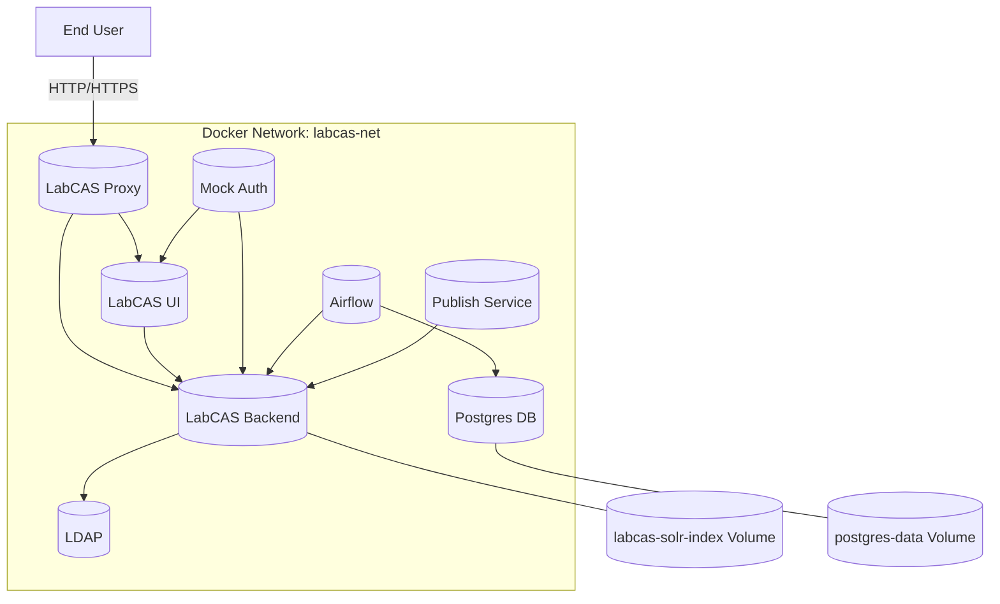

# LabCAS Docker Environment

This repository provides a Dockerized setup for LabCAS (Laboratory Catalog and Archive System) at JPL. It includes a `Dockerfile` and a `build_labcas.sh` script for automating the process of building and running the LabCAS environment, complete with LDAP configuration, Apache, and backend services.

## Table of Contents

- [Overview](#overview)
- [Prerequisites](#prerequisites)
- [Installation](#installation)
- [Usage](#usage)
- [Configuration](#configuration)
- [Advanced Usage](#advanced-usage)
- [Contributing](#contributing)
- [License](#license)

## Overview

This project automates the deployment of the LabCAS environment using Docker. The Docker image contains all necessary dependencies, including OpenJDK, Apache, LDAP, and the LabCAS backend. The `build_labcas.sh` script simplifies the build and run process, handling LDAP initialization, Apache setup, and backend service execution.

## Prerequisites

Before you begin, ensure you have the following installed:

- [Docker](https://docs.docker.com/get-docker/)
- [Git](https://git-scm.com/)
- [Bash](https://www.gnu.org/software/bash/) (for running the provided script)
- A valid LabCAS username and password for accessing the resources

## Installation

1. **Clone the Repository**

   ```bash
   git clone https://github.com/your-username/labcas-docker.git
   cd labcas-docker
    ```
2. **Configure Credentials**

   You will need your LabCAS username and password for authentication. These can be configured directly in the `build_labcas.sh` script or passed as environment variables.

## Usage

To build and run the LabCAS Docker environment, simply run:

```bash
docker-compose up --build
```

If you have already run previous builds and re-running, recommend shutting down previous environments first:

```bash
docker-compose down
docker-compose up --build
```

This script will:

1. Build the Docker image across the `Dockerfiles` in subdirectories labcas-ui, labcas-backend, and ldap.
2. Run the Docker container with the necessary environment variables.
3. Initialize the LDAP configuration.
4. Start the Apache server.
5. Launch the LabCAS backend services.

## Important Notes and Troubleshooting

### Docker Container Error
If you get an error that a previous Docker container still exists, run the following command to remove the container:
```bash
docker rm [9c*** container ID]
```

## Configuration

### Configuration Change: ui/environment.cfg
Please update the following file: ui/environment.cfg. Replace ip_address_placeholder with the actual IP address of your server. If you are running this locally on a MacBook, you can use localhost as the IP address:
```bash
ip_address_placeholder -> localhost (or your server IP)
```

### Environment Variables

You can configure the following environment variables to customize your setup:

- `LDAP_ADMIN_USERNAME`: The LDAP admin username (default: `admin`)
- `LDAP_ADMIN_PASSWORD`: The LDAP admin password (default: `secret`)
- `LDAP_ROOT`: The LDAP root domain (default: `dc=labcas,dc=jpl,dc=nasa,dc=gov`)
- `HOST_PORT_HTTP`: The host port to map to container's port 80 (default: `80`)
- `HOST_PORT_HTTPS`: The host port to map to container's port 8444 (default: `8444`)

### Script Configuration

To modify the build and run process, you can edit the `build_labcas.sh` script. The following variables are available:

- `IMAGE_NAME`: The name of the Docker image to build (default: `labcas_debug_image`)
- `CONTAINER_NAME`: The name of the Docker container to run (default: `labcas_debug_instance`)


## Architecture

The following diagrams capture the architecture of the system.

### Deployment Diagram




### C4 Diagram

```mermaid
C4Deployment
title LabCAS Deployment

Deployment_Node(host, "Host Machine", "Linux Server") {
    Deployment_Node(docker, "Docker Engine", "Docker") {
        Deployment_Node(net, "labcas-net", "Docker Network") {
            Container(ldap, "LDAP", "Custom Build", "Provides LDAP directory service with LDAPS on port 1636")
            Container(backend, "LabCAS Backend", "Tomcat/Java", "Core backend service; exposes 8081, 8444, 8984")
            Container(ui, "LabCAS UI", "Apache HTTPD", "Web front-end")
            Container(mockauth, "Mock Auth", "Node/Express", "Authentication mock service on port 3001")
            Container(proxy, "LabCAS Proxy", "Nginx", "Reverse proxy handling HTTPS/HTTP on 443, 80, 8099")
            Container(postgres, "Postgres", "Postgres 13", "Database for Airflow")
            Container(airflow, "Airflow", "Python/LocalExecutor", "Workflow orchestration with DAGs; exposed on 8082")
            Container(publish, "Publish Service", "Custom Build", "Handles publishing pipeline, connects to Solr in backend")
        }
    }
}

Rel(user, proxy, "HTTPS/HTTP requests")
Rel(proxy, ui, "Routes traffic")
Rel(proxy, backend, "Routes API traffic")

Rel(ui, backend, "Calls APIs")
Rel(backend, ldap, "LDAP Authentication", "LDAPS 1636")
Rel(mockauth, backend, "Uses backend APIs")
Rel(mockauth, ui, "Integrates with UI")
Rel(airflow, backend, "Fetches data & triggers jobs")
Rel(airflow, postgres, "Stores workflow metadata")
Rel(publish, backend, "Sends data to Solr (8984)")

Deployment_Node(vols, "Volumes", "Docker Volumes") {
    ContainerDb(vol1, "labcas-solr-index", "Volume", "Solr index storage")
    ContainerDb(vol2, "postgres-data", "Volume", "Postgres persistent data")
}

Rel(backend, vol1, "Stores Solr index")
Rel(postgres, vol2, "Stores DB data")
```


## Contributing

Contributions are welcome! Please fork the repository, make your changes, and submit a pull request.

## License

The project is licensed under the Apache version 2 license.
