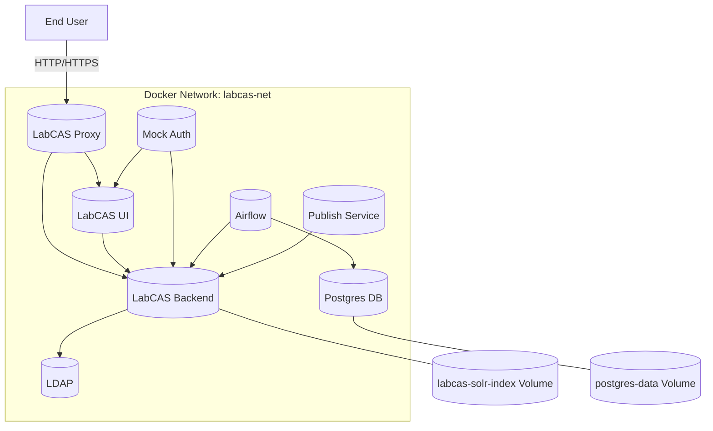

# LabCAS Docker Environment

This repository provides a Dockerized setup for LabCAS (Laboratory Catalog and Archive System) at JPL. It includes a `Dockerfile` and a `build_labcas.sh` script for automating the process of building and running the LabCAS environment, complete with LDAP configuration, Apache, and backend services.

## Table of Contents

- [Overview](#overview)
- [Prerequisites](#prerequisites)
- [Installation](#installation)
- [Usage](#usage)
- [Configuration](#configuration)
- [Advanced Usage](#advanced-usage)
- [Contributing](#contributing)
- [License](#license)

## Overview

This project automates the deployment of the LabCAS environment using Docker. The Docker image contains all necessary dependencies, including OpenJDK, Apache, LDAP, and the LabCAS backend.

## Prerequisites

Before you begin, ensure you have the following installed:

- [Docker](https://docs.docker.com/get-docker/)
- [Git](https://git-scm.com/)
- A valid LabCAS username and password for accessing the resources

## Installation

1. **Clone the Repository**

   ```bash
   git clone https://github.com/your-username/labcas-docker.git
   cd labcas-docker
    ```
2. **Configure Credentials**

   This step is no longer necessary as the `build_labcas.sh` script has been removed.


## Usage

To build and run the LabCAS Docker environment, simply run:

```bash
docker-compose up --build
```

If you have already run previous builds and re-running, recommend shutting down previous environments first:

```bash
docker-compose down
docker-compose up --build
```

The Docker Composition above will:

1. Build the Docker image across the `Dockerfiles` in subdirectories labcas-ui, labcas-backend, and ldap.
2. Run the Docker container with the necessary environment variables.
3. Initialize the LDAP configuration.
4. Start the Apache server.
5. Launch the LabCAS backend services.

## Important Notes and Troubleshooting

### Docker Container Error
If you get an error that a previous Docker container still exists, run the following command to remove the container:
```bash
docker rm [9c*** container ID]
```

## Configuration

The following subsections describe how to configure LabCAS Docker.

### Configuration Change: `ui/environment.cfg`

An earlier version LabCAS Docker required a setting of `ip_address_placeholder` in `ui/environment.cfg`, however this setting no longer appears.

### Environment Variables

You can configure the following environment variables to customize your setup:

- `LDAP_ADMIN_USERNAME`: The LDAP admin username (default: `admin`)
- `LDAP_ADMIN_PASSWORD`: The LDAP admin password (default: `secret`)
- `LDAP_ROOT`: The LDAP root domain (default: `dc=labcas,dc=jpl,dc=nasa,dc=gov`)
- `HOST_PORT_HTTP`: The host port to map to container's port 80 (default: `80`)
- `HOST_PORT_HTTPS`: The host port to map to container's port 8444 (default: `8444`)

### Script Configuration

This is no longer necessary as the `build_labcas.sh` script no longer exists! 🎉


## Architecture

The following diagrams capture the architecture of the system.

### Deployment Diagram




## Contributing

Contributions are welcome! Please fork the repository, make your changes, and submit a pull request.

## License

The project is licensed under the Apache version 2 license.
