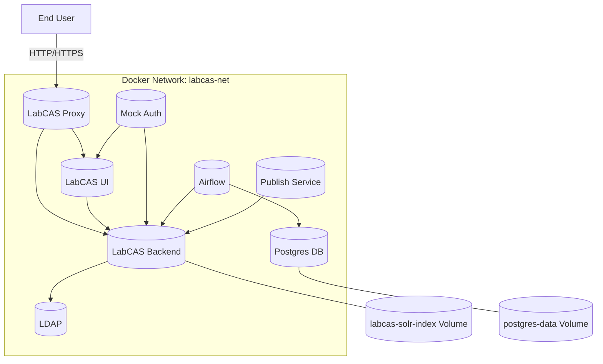

# LabCAS Docker Environment

This repository provides a Dockerized setup for LabCAS (Laboratory Catalog and Archive System) at JPL. It includes Dockerfiles and a `docker-compose.yml` for automating the process of building and running the LabCAS environment, complete with LDAP configuration, Apache for the UI, an Nginx proxy, Airflow, and backend services.

## Table of Contents

- [Overview](#overview)
- [Prerequisites](#prerequisites)
- [Installation](#installation)
- [Usage](#usage)
- [Configuration](#configuration)
- [Architecture](#architecture)
- [Services and Ports](#services-and-ports)
- [Important Notes and Troubleshooting](#important-notes-and-troubleshooting)
- [Additional Setup (.env)](#additional-setup-env)
- [Quick Start: Publish Demo (Airflow)](#quick-start-publish-demo-airflow)
- [Quick Start: Genomic LinkML Validation + Publish (Airflow)](#quick-start-genomic-linkml-validation-publish-airflow)
- [Known CORS Behavior](#known-cors-behavior)
- [Diagnostics Script](#diagnostics-script)
- [Contributing](#contributing)
- [License](#license)

## Overview

This project automates the deployment of the LabCAS environment using Docker. The images contain all necessary dependencies, including OpenJDK, Apache, LDAP, and the LabCAS backend. Docker Compose simplifies the build and run process, handling LDAP initialization, proxy setup, UI, and backend service execution.

## Prerequisites

Before you begin, ensure you have the following installed:

- [Docker](https://docs.docker.com/get-docker/)
- [Git](https://git-scm.com/)
- [Bash](https://www.gnu.org/software/bash/) (for running the provided script)
- A valid LabCAS username and password for accessing the resources

## Installation

1. **Clone the Repository**

   ```bash
   git clone https://github.com/Labcas-NIST/labcas-docker.git
   cd labcas-docker
    ```
2. **Configure Credentials**

   You will need your LabCAS username and password for authentication when logging into the UI. For local testing, the default UI credentials are `dliu/secret`. You can manage environment values via the `.env` file and service configuration in `docker-compose.yml`.

## Usage

To build and run the LabCAS Docker environment, simply run:

```bash
docker compose up --build
```

If you have already run previous builds and re-running, recommend shutting down previous environments first:

```bash
docker compose down
docker compose up --build
```

This will:

1. Build images across the Dockerfiles in subdirectories `labcas-ui`, `labcas-backend`, and `ldap`.
2. Start the containers with the necessary environment variables.
3. Initialize the LDAP configuration.
4. Start the Apache-based UI and the Nginx proxy.
5. Launch the LabCAS backend services and supporting components.

## Important Notes and Troubleshooting

### Docker Container Error
If you get an error that a previous Docker container still exists, run the following command to remove the container:
```bash
docker rm [9c*** container ID]
```

## Configuration

### Configuration Change: labcas-ui/environment.cfg
Please review the following file: `labcas-ui/environment.cfg`. For local development, the proxy is configured to route UI API calls to the backend using `/labcas-backend/` so you typically do not need to change IP addresses.

Key fields for local testing:
```json
{
  "environment": "/labcas-backend/",
  "sso_enabled": "false"
}
```

### Environment Variables

You can configure environment variables via the `.env` file and `docker-compose.yml` to customize your setup. Common values include:

- `LDAP_ADMIN_USERNAME`: The LDAP admin username (default: `admin`).
- `LDAP_ADMIN_PASSWORD`: The LDAP admin password (default: `secret`).
- `LDAP_ROOT`: The LDAP root domain (default: `dc=labcas,dc=jpl,dc=nasa,dc=gov`).
- `GITHUB_TOKEN`: Token used by Airflow/Publish to access GitHub.
- `PUBLISH_*`: Variables used by the publish service (see Additional Setup (.env) below).

Note: Service ports are defined in `docker-compose.yml` (proxy: 80/443, backend: 8444, Airflow: 8082, UI: 8081).

### Service Configuration

To modify the build and run process, edit `docker-compose.yml` and the `.env` file. Adjust service ports, volumes, and environment variables as needed. The Additional Setup (.env) section below shows typical variables for local publishing and data paths.


## Architecture

The following diagrams capture the architecture of the system.

### Deployment Diagram




## Services and Ports

- labcas-proxy: Reverse proxy and TLS termination
  - Host ports: `80`, `443` (and `8099`)
  - Routes: UI at `https://localhost/labcas-ui/`, backend (proxied) at `https://localhost/labcas-backend/`
  - Recommended entrypoint for local usage
- labcas-ui: Apache serving the UI
  - Host port: `8081` (container `8081`)
  - Typically accessed via the proxy; direct access to `http://localhost:8081/labcas-ui/` is optional for troubleshooting
- labcas-backend: LabCAS backend services (Tomcat)
  - Host ports: `8444` (backend), `8984` (Solr)
  - Direct endpoints: `https://localhost:8444/`, Solr at `https://localhost:8984/solr/`
- ldap: Directory service (LDAPS)
  - Host port: `1636` (TLS enabled, self-signed)
- postgres: Airflow metadata database
  - Internal port: `5432` (not published to host)
- airflow: Orchestration and web UI
  - Host port: `8082` (maps to container `8080`), UI at `http://localhost:8082/` (login: `admin/admin`)
- publish: Metadata publishing utility
  - No external ports; invoked via `docker exec labcas-publish ...` and uses Solr at `https://labcas-backend:8984/solr/`
- mock-auth: Optional mock authentication service
  - Host port: `3001`


## Additional Setup (.env)

Compose automatically reads a `.env` file at the project root. Create one with your GitHub token and paths so Airflow and the publish service can access local data and config.

Example `.env`:

```
GITHUB_TOKEN=your_github_token_here

# Publish settings
PUBLISH_CONSORTIUM=NIST
PUBLISH_COLLECTION=Basophile
PUBLISH_COLLECTION_SUBSET=
PUBLISH_ID=
PUBLISH_STEPS=crawl,publish

# Host paths (absolute paths to your project folders)
HOST_METADATA_PATH=/absolute/path/to/your/project/data/staging/
HOST_PUBLISH_CONFIG=/absolute/path/to/your/project/shared-config/publish

# Optional (used by docker-compose mounts)
HOST_DATA_PATH=/absolute/path/to/your/project/data
HOST_ARCHIVE_PATH=/absolute/path/to/your/project/data/archive
HOST_LABCAS_DATA=/absolute/path/to/your/project/data/labcas-data
```

Notes:
- Put the `.env` file in the project root directory.
- Keep your `GITHUB_TOKEN` private; do not commit it to source control.

## Quick Start: Publish Demo (Airflow)

This workflow parses a sample CSV and publishes a Basophile collection via the included Airflow DAG and publish service.

1) Build and start services

```bash
docker compose build --no-cache && docker compose up -d
# If using the v1 plugin, the equivalent is:
# docker-compose build --no-cache && docker-compose up -d
```

2) Trigger the Airflow DAG

```bash
docker compose exec airflow airflow dags trigger parse_and_publish
```

3) Check Airflow UI

- URL: `http://localhost:8082/`
- Login: `admin` / `admin`
- Browse -> DAG Runs -> confirm the run succeeded.
- If it remains queued, click into the DAG and press the play button (Trigger DAG).

4) Verify in LabCAS UI

- URL: `https://localhost/labcas-ui`
- Test login: `dliu` / `secret`
- You should see the initial `test_collection` and the newly published `Basophile` collection.

Tips:
- Accept the browser warning for the self-signed certificate when visiting `https://localhost`.
- UI config lives at `labcas-ui/environment.cfg`. The default sets `"environment": "/labcas-backend/"`, which routes UI API calls through the proxy.

## Quick Start: Genomic LinkML Validation + Publish (Airflow)

This workflow runs a minimal genomic "hello world" mapper, validates the mapped payload against
the `Datasetlevel` class from `usnistgov/nist-labcas-linkml`, then publishes the resulting
collection/dataset/file into LabCAS using the transient `labcas-publish` container.

1) Build and start services

```bash
docker compose build --no-cache && docker compose up -d
```

2) Trigger the DAG

```bash
docker compose exec airflow airflow dags trigger genomic_helloworld_linkml_validation
```

3) Confirm success

- Airflow UI: `http://localhost:8082/`
- DAG: `genomic_helloworld_linkml_validation`
- Successful tasks:
  - `reset_generated_state`
  - `create_hello_world_input`
  - `map_genomic_payload`
  - `wait_validator_container`
  - `validate_linkml_payload`
  - `generate_publish_cfg`
  - `stage_archive_file`
  - `wait_publish_container`
  - `publish_metadata`
  - `publish_files_only` (no-op unless `RUN_PUBLISH_FILES_ONLY=true`)

Generated files:
- Input: `/data/raw/genomic_helloworld/input.json`
- Raw file: `/data/raw/genomic_helloworld/GENOMIC-HELLO-001.fastq`
- Mapped output: `/data/staging/genomic_helloworld/datasetlevel.yaml`
- Metadata cfgs: `/metadata/genomic_helloworld/...`
- Archive payload: `/data/archive/nist/genomic_helloworld/mission/GENOMIC-HELLO-001.fastq`

4) Verify in LabCAS UI

- URL: `https://localhost/labcas-ui`
- Login: `dliu` / `secret`
- Confirm collection `genomic_helloworld` appears and contains dataset `mission`.

Runtime notes:
- The Airflow startup script builds and runs a DIND container named
  `labcas-linkml-validator` from `airflow/scripts/linkml_validator_dind.Dockerfile`.
- The validator clones `https://github.com/usnistgov/nist-labcas-linkml.git`
  and validates mapped payloads via `python /opt/linkml/linkml_validate.py`.
- If the LinkML repo requires authentication, set `GITHUB_TOKEN` (or `LINKML_GITHUB_TOKEN`)
  in `.env` so the DIND build can clone it.
- Validation output is saved per DAG run under
  `/data/logs/airflow/linkml_validation/` (host path: `data/logs/airflow/linkml_validation/`).
  Override with `GENOMIC_HELLOWORLD_LINKML_LOG_DIR`.

## Known CORS Behavior

The UI and backend are served on different ports by default (`80/443` via proxy for UI and `8444` directly on the backend). The provided `labcas-proxy` routes UI requests under `/labcas-backend/` to the backend to avoid CORS in normal usage.

- Prefer accessing the UI at `https://localhost/labcas-ui` so calls go through the proxy.
- If you bypass the proxy and call the backend directly on `8444`, your browser may block requests due to CORS.
- For temporary local testing only, you can launch a separate Chrome instance with web security disabled:
  - macOS: `open -na "Google Chrome" --args --disable-web-security --user-data-dir=/tmp/chrome_dev`
  - Use a throwaway profile and close it when done. Do not use this for regular browsing.

## Diagnostics Script

Use `diagnose_labcas.sh` to quickly validate container health, proxy routing, ports, and the authentication flow.

Run it after the stack is up:

```bash
chmod +x diagnose_labcas.sh
./diagnose_labcas.sh
# or: bash diagnose_labcas.sh
```

What it checks (summary):
- Docker Compose presence and required containers running: `labcas-backend`, `labcas-ui`, `labcas-proxy`, `ldap`, `postgres`.
- Docker network `labcas-net`, internal DNS (e.g., backend resolves `ldap`).
- Nginx proxy: syntax validation and that routes/upstreams exist for UI and backend.
- Host port bindings: 80, 443, 8082, 8081, 8444 and HTTP→HTTPS redirect.
- Backend reachability directly (`https://localhost:8444/`) and via proxy (`/labcas-backend/`).
- Authentication API existence: `/labcas-backend/labcas-backend-data-access-api/auth` (GET/POST response codes).
- Backend processes (tomcat/java) and deployed webapps artifacts.
- LDAP service health and reachability on port 1636; LDAP-related settings in `labcas.properties`.
- UI `environment.cfg` fields: `environment`, `sso_enabled`, and UI availability at `/labcas-ui/`.
- End-to-end authentication flow from UI to backend endpoint.

Interpreting results:
- The script reports counts of critical issues and warnings. Exit code equals the number of critical issues (0 = healthy).
- Common flagged issues and fixes:
  - Auth endpoint 404: ensure the authentication webapp/WAR is deployed to Tomcat and the endpoint path is correct.
  - Backend not running: `docker compose up -d labcas-backend`; check `docker compose logs labcas-backend`.
  - Proxy misrouting: validate Nginx config inside `labcas-proxy` and confirm upstreams resolve.
  - LDAP unreachable: confirm `ldap` is healthy and port 1636 is open inside the network; verify `labcas.properties`.
  - UI config mismatch: ensure `labcas-ui/environment.cfg` has `"environment": "/labcas-backend/"` when using the proxy.

Helpful commands:
- `docker compose logs` to review service logs.
- `docker exec labcas-proxy nginx -t` to validate Nginx config.
- `docker exec labcas-proxy tail -f /var/log/nginx/labcas-backend.error.log` for proxy errors.
- `docker exec labcas-backend curl -k https://localhost:8444/` to probe backend from inside the container.

Configuration files to review:
- `./labcas-ui/environment.cfg`
- `./labcas-backend/labcas.properties`
- `./labcas-proxy` configs (e.g., `nginx-default.conf`)

## Contributing

Contributions are welcome! Please fork the repository, make your changes, and submit a pull request.

## License

The project is licensed under the Apache version 2 license.
