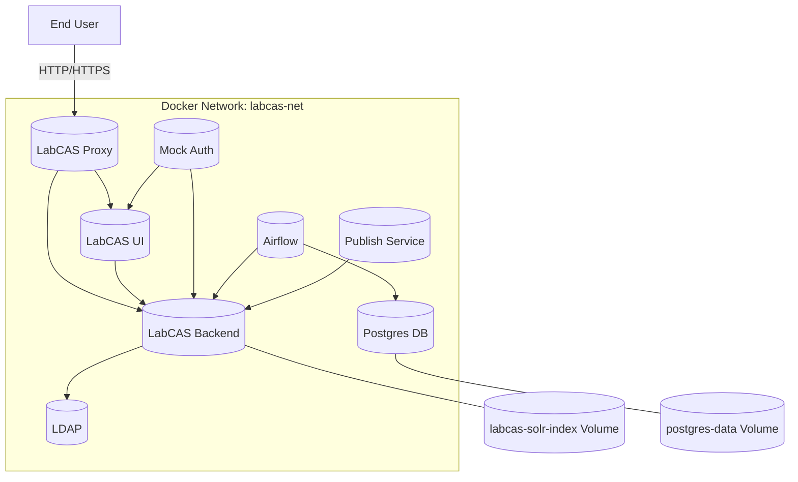
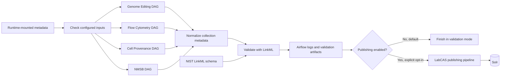

# LabCAS Docker Environment

This repository provides a Dockerized setup for LabCAS (Laboratory Catalog and Archive System) at JPL. It includes Dockerfiles and a `docker-compose.yml` for automating the process of building and running the LabCAS environment, complete with LDAP configuration, Apache for the UI, an Nginx proxy, Airflow, and backend services.

For a plain-English Mac setup guide intended for non-developers, see `docs/macbook-setup.md`.

## Table of Contents

- [Overview](#overview)
- [Prerequisites](#prerequisites)
- [Installation](#installation)
- [Usage](#usage)
- [Configuration](#configuration)
- [Architecture](#architecture)
- [Services and Ports](#services-and-ports)
- [Important Notes and Troubleshooting](#important-notes-and-troubleshooting)
- [Additional Setup (.env)](#additional-setup-env)
- [Quick Start: Publish Demo (Airflow)](#quick-start-publish-demo-airflow)
- [Known CORS Behavior](#known-cors-behavior)
- [Diagnostics Script](#diagnostics-script)
- [Contributing](#contributing)
- [License](#license)

## Overview

This project automates the deployment of the LabCAS environment using Docker. The images contain all necessary dependencies, including OpenJDK, Apache, LDAP, and the LabCAS backend. Docker Compose simplifies the build and run process, handling LDAP initialization, proxy setup, UI, and backend service execution.

## Prerequisites

Before you begin, ensure you have the following installed:

- [Docker](https://docs.docker.com/get-docker/)
- [Git](https://git-scm.com/)
- [Bash](https://www.gnu.org/software/bash/) (for running the provided script)
- A valid LabCAS username and password for accessing the resources

## Installation

1. **Clone the Repository**

   ```bash
   git clone https://github.com/Labcas-NIST/labcas-docker.git
   cd labcas-docker
    ```
2. **Configure Credentials**

   You will need a LabCAS username and password to log into the UI. Request local test credentials from the repository owner. You can manage environment values via the `.env` file and service configuration in `docker-compose.yml`.

## Usage

To build and run the LabCAS Docker environment, simply run:

```bash
docker compose up --build
```

If you have already run previous builds and re-running, recommend shutting down previous environments first:

```bash
docker compose down
docker compose up --build
```

This will:

1. Build images across the Dockerfiles in subdirectories `labcas-ui`, `labcas-backend`, and `ldap`.
2. Start the containers with the necessary environment variables.
3. Initialize the LDAP configuration.
4. Start the Apache-based UI and the Nginx proxy.
5. Launch the LabCAS backend services and supporting components.

## Important Notes and Troubleshooting

### Docker Container Error
If you get an error that a previous Docker container still exists, run the following command to remove the container:
```bash
docker rm [9c*** container ID]
```

## Configuration

### Configuration Change: labcas-ui/environment.cfg
Please review the following file: `labcas-ui/environment.cfg`. For local development, the proxy is configured to route UI API calls to the backend using `/labcas-backend/` so you typically do not need to change IP addresses.

Key fields for local testing:
```json
{
  "environment": "/labcas-backend/",
  "sso_enabled": "false"
}
```

### Environment Variables

You can configure environment variables via the `.env` file and `docker-compose.yml` to customize your setup. Common values include:

- `LDAP_ADMIN_USERNAME`: The LDAP admin username (default: `admin`).
- `LDAP_ADMIN_PASSWORD`: The LDAP admin password (default: `secret`).
- `LDAP_ROOT`: The LDAP root domain (default: `dc=labcas,dc=jpl,dc=nasa,dc=gov`).
- `GITHUB_TOKEN`: Token used by Airflow/Publish to access GitHub.
- `PUBLISH_*`: Variables used by the publish service (see Additional Setup (.env) below).

Note: Service ports are defined in `docker-compose.yml` (proxy: 80/443, backend: 8444, Airflow: 8082, UI: 8081).

### Service Configuration

To modify the build and run process, edit `docker-compose.yml` and the `.env` file. Adjust service ports, volumes, and environment variables as needed. The Additional Setup (.env) section below shows typical variables for local publishing and data paths.


## Architecture

The following diagrams capture the architecture of the system.

### Deployment Diagram




## Services and Ports

- labcas-proxy: Reverse proxy and TLS termination
  - Host ports: `80`, `443` (and `8099`)
  - Routes: UI at `https://localhost/labcas-ui/`, backend (proxied) at `https://localhost/labcas-backend/`
  - Recommended entrypoint for local usage
- labcas-ui: Apache serving the UI
  - Host port: `8081` (container `8081`)
  - Typically accessed via the proxy; direct access to `http://localhost:8081/labcas-ui/` is optional for troubleshooting
- labcas-backend: LabCAS backend services (Tomcat)
  - Host ports: `8444` (backend), `8984` (Solr)
  - Direct endpoints: `https://localhost:8444/`, Solr at `https://localhost:8984/solr/`
- ldap: Directory service (LDAPS)
  - Host port: `1636` (TLS enabled, self-signed)
- postgres: Airflow metadata database
  - Internal port: `5432` (not published to host)
- airflow: Orchestration and web UI
  - Host port: `8082` (maps to container `8080`), UI at `http://localhost:8082/` (login: `admin/admin`)
- publish: Metadata publishing utility
  - No external ports; invoked via `docker exec labcas-publish ...` and uses Solr at `https://labcas-backend:8984/solr/`
- mock-auth: Optional mock authentication service
  - Host port: `3001`


## Additional Setup (.env)

Compose automatically reads a `.env` file at the project root. Create one with your GitHub token and paths so Airflow and the publish service can access local data and config.

Example `.env`:

```
GITHUB_TOKEN=your_github_token_here

# Publish settings
PUBLISH_CONSORTIUM=NIST
PUBLISH_COLLECTION=your_collection_name
PUBLISH_COLLECTION_SUBSET=
PUBLISH_ID=
PUBLISH_STEPS=crawl,publish

# Runtime data and configuration mounts are deployment-specific. Set their
# corresponding environment variables outside Git for the target deployment.
```

Notes:
- Put the `.env` file in the project root directory.
- Keep your `GITHUB_TOKEN` private; do not commit it to source control.

## Quick Start: Publish Demo (Airflow)

The Airflow publish demo is a collection-specific LinkML pipeline. Metadata inputs are supplied at runtime and are intentionally excluded from this public repository. Each DAG normalizes its collection's source format, validates the normalized records, preserves validation evidence in Airflow, and reaches the existing LabCAS publishing task.

Publishing is disabled by default. A normal demo run exercises the complete workflow but stops at the publish gate without sending records to Solr.

### Collection-specific DAGs

| Collection workflow | Airflow DAG | LinkML validation scope |
| --- | --- | --- |
| Genome Editing | `genome_editing_linkml_validate_and_publish` | Collection, dataset, and file metadata |
| Flow Cytometry | `flow_cytometry_linkml_validate_and_publish` | Flow Cytometry extension records |
| Cell Provenance | `cell_provenance_linkml_validate_and_publish` | Cell Line Expansion provenance records |
| NMSB | `nmsb_linkml_validate_and_publish` | NMSB collection and dataset metadata |

### Workflow



The exact normalization tasks differ by collection, but every DAG keeps the validation and publish decision visible as separate Airflow tasks. A validation error stops the DAG before the publish gate.

### Runtime configuration

Configure the source metadata outside Git and mount it into both Airflow and the validator where required. The collection DAGs read these settings:

| Workflow | Required runtime settings |
| --- | --- |
| Genome Editing | `GENOME_LINKML_COLLECTION_INPUT`, `GENOME_LINKML_DATASET_INPUT`, `GENOME_LINKML_FILE_INPUT` |
| Flow Cytometry | `FLOW_LINKML_INPUT_DIR` or `FLOW_LINKML_MANIFEST` |
| Cell Provenance | `CELL_LINKML_BUNDLE`, `NIST_LINKML_SCHEMA_PATH` |
| NMSB | `NMSB_COLLECTION_WORKBOOK`, `NMSB_DATASET_WORKBOOK`, `NMSB_ELAB_JSON`, `NMSB_RECORD_ID`, `NMSB_DATASET_ID` |

Output, staging, and log locations can also be overridden with the corresponding collection-specific environment variables. Do not commit local metadata, generated payloads, logs, credentials, or deployment-specific paths.

### Run a validation-only demo

1. Configure and mount the selected collection's input metadata.
2. Start the Docker Compose services.
3. Trigger one collection DAG:

```bash
docker compose exec airflow airflow dags trigger <dag_id>
```

4. Open the Airflow UI, select the DAG run, and use Grid or Graph view to follow the input check, normalization, LinkML validation, and publish-gate tasks.
5. Open the validation task log to review per-record pass/fail messages and the summary. The final publish task should report that Solr publishing was skipped.

### Enable publishing explicitly

Only enable this after validating the metadata and configuring the target deployment and credentials:

```json
{
  "publish_enabled": "true",
  "publish_collection": "<configured collection>"
}
```

The publish task requires runtime credentials and publisher configuration. No usernames, passwords, tokens, or source metadata belong in this repository.

## Known CORS Behavior

The UI and backend are served on different ports by default (`80/443` via proxy for UI and `8444` directly on the backend). The provided `labcas-proxy` routes UI requests under `/labcas-backend/` to the backend to avoid CORS in normal usage.

- Prefer accessing the UI at `https://localhost/labcas-ui` so calls go through the proxy.
- If you bypass the proxy and call the backend directly on `8444`, your browser may block requests due to CORS.
- For temporary local testing only, you can launch a separate Chrome instance with web security disabled:
  - macOS: `open -na "Google Chrome" --args --disable-web-security --user-data-dir=/tmp/chrome_dev`
  - Use a throwaway profile and close it when done. Do not use this for regular browsing.

## Diagnostics Script

Use `diagnose_labcas.sh` to quickly validate container health, proxy routing, ports, and the authentication flow.

Run it after the stack is up:

```bash
chmod +x diagnose_labcas.sh
./diagnose_labcas.sh
# or: bash diagnose_labcas.sh
```

What it checks (summary):
- Docker Compose presence and required containers running: `labcas-backend`, `labcas-ui`, `labcas-proxy`, `ldap`, `postgres`.
- Docker network `labcas-net`, internal DNS (e.g., backend resolves `ldap`).
- Nginx proxy: syntax validation and that routes/upstreams exist for UI and backend.
- Host port bindings: 80, 443, 8082, 8081, 8444 and HTTP→HTTPS redirect.
- Backend reachability directly (`https://localhost:8444/`) and via proxy (`/labcas-backend/`).
- Authentication API existence: `/labcas-backend/labcas-backend-data-access-api/auth` (GET/POST response codes).
- Backend processes (tomcat/java) and deployed webapps artifacts.
- LDAP service health and reachability on port 1636; LDAP-related settings in `labcas.properties`.
- UI `environment.cfg` fields: `environment`, `sso_enabled`, and UI availability at `/labcas-ui/`.
- End-to-end authentication flow from UI to backend endpoint.

Interpreting results:
- The script reports counts of critical issues and warnings. Exit code equals the number of critical issues (0 = healthy).
- Common flagged issues and fixes:
  - Auth endpoint 404: ensure the authentication webapp/WAR is deployed to Tomcat and the endpoint path is correct.
  - Backend not running: `docker compose up -d labcas-backend`; check `docker compose logs labcas-backend`.
  - Proxy misrouting: validate Nginx config inside `labcas-proxy` and confirm upstreams resolve.
  - LDAP unreachable: confirm `ldap` is healthy and port 1636 is open inside the network; verify `labcas.properties`.
  - UI config mismatch: ensure `labcas-ui/environment.cfg` has `"environment": "/labcas-backend/"` when using the proxy.

Helpful commands:
- `docker compose logs` to review service logs.
- `docker exec labcas-proxy nginx -t` to validate Nginx config.
- `docker exec labcas-proxy tail -f /var/log/nginx/labcas-backend.error.log` for proxy errors.
- `docker exec labcas-backend curl -k https://localhost:8444/` to probe backend from inside the container.

Configuration files to review:
- `./labcas-ui/environment.cfg`
- `./labcas-backend/labcas.properties`
- `./labcas-proxy` configs (e.g., `nginx-default.conf`)

## Contributing

Contributions are welcome! Please fork the repository, make your changes, and submit a pull request.

## License

The project is licensed under the Apache version 2 license.
